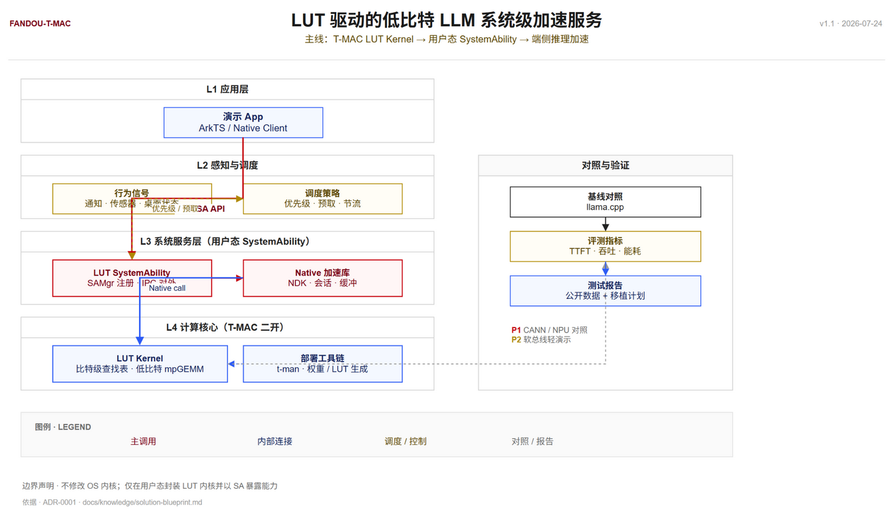
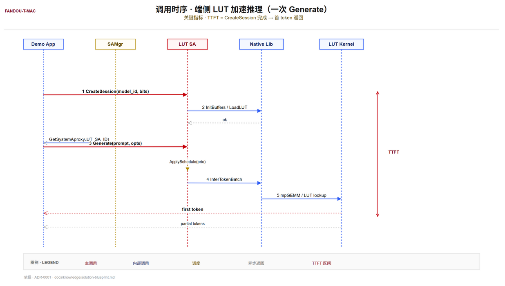

# LUT-SA · 鸿蒙高校创新赛

> **竞赛 fork（fandou-t-mac）**：本仓库基于 [microsoft/T-MAC](https://github.com/microsoft/T-MAC)（EuroSys 2025）二开，把比特级查找表（LUT）驱动的低比特 LLM 推理封装为 **OpenHarmony / HarmonyOS 用户态 SystemAbility** 加速服务，参赛「鸿蒙高校创新赛 · 方向四 · 操作系统智能创新」。  
> 作品技术名 **LUT-SA**，队伍 **翻斗花园（中北大学）**。

<p align="center">
  
</p>

## 一句话创意

把比特级查找表（LUT）驱动的低比特 LLM 推理范式封装为 OpenHarmony / HarmonyOS 用户态系统能力，用轻量行为感知做动态资源调度，把首字延迟和能耗在端侧压下去。

## 系统架构

四层垂直单向依赖：L1 应用层 → L2 感知与调度 → L3 系统服务层（用户态 SystemAbility）→ L4 计算核心（T-MAC 二开 LUT Kernel）。右侧并列「对照与验证」，与 llama.cpp 反量化基线对照。

<p align="center">
  
</p>

> 源文件：`assets/images/readme/architecture-phase1.drawio` · 设计说明：`assets/images/readme/architecture-phase1.md`

## 调用时序

五条 lifeline：Demo App → SAMgr → LUT SA → Native Lib → LUT Kernel。一次完整 Generate 走 1 到 5 步：CreateSession → InitBuffers / LoadLUT → Generate → InferTokenBatch → mpGEMM / LUT lookup。右侧 TTFT 标尺覆盖 CreateSession 完成 → 首 token 返回。

<p align="center">
  
</p>

> 源文件：`assets/images/readme/sequence-phase1.drawio` · 设计说明：`assets/images/readme/sequence-phase1.md`

## 公开性能基线

数据出处：上游 T-MAC `docs/profiling_data.md`。单位 tokens / sec。

| 模型 | 设备 | 线程 | llama.cpp | T-MAC | 约倍速 |
|---|---|---|---|---|---|
| BitNet-3B | M2-Ultra | 1 | 6.49 | 22.08 | ~3.4× |
| BitNet-3B | M2-Ultra | 4 | 22.09 | 54.46 | ~2.5× |
| BitNet-3B | Raspberry Pi 5 | 1 | 1.37 | 8.03 | ~5.9× |
| BitNet-3B | Raspberry Pi 5 | 2 | 2.71 | 11.09 | ~4.1× |
| Llama-2-7B (W2) | M2-Ultra | 1 | 3.82 | 16.68 | ~4.4× |
| Llama-2-7B (W2) | AGX Orin | 1 | 0.79 | 4.36 | ~5.5× |

> 上游公开数据，非本队板测。复赛阶段在 OpenHarmony 模拟器或 ARM 设备完成复现与补充实测。

## 移植到 OpenHarmony / HarmonyOS 的路线

| 步骤 | 内容 | 阶段 |
|---|---|---|
| 1 | 抽取 LUT Kernel 为 Native 静态 / 动态库，参考 Android 交叉编译经验 | 复赛前期 |
| 2 | DevEco 创建 Native 模块，打通最小推理调用 | 复赛前期 |
| 3 | 封装 SystemAbility，暴露 Load / Infer / Metrics | 复赛中期 |
| 4 | 叠加轻量感知调度；与 llama.cpp 或官方量化路径对照 | 复赛中后期 |
| 5 | 固化本平台 TTFT、tokens / s、（可选）功耗数据 | 复赛提交前 |

## 作品介绍

低比特大模型在边缘设备落地时，主流路径仍以反量化后高精度乘加实现，反量化访存与转换开销显著抵消低比特收益；多任务并发场景下，首字延迟（TTFT）与能耗指标进一步劣化。赛题要求在现有操作系统架构下提升系统 AI 任务运行效率，纯应用层 Demo 难以承载「系统级创新」这一命题。

作品 LUT-SA 以开源 T-MAC（EuroSys 2025）比特级查找表范式为计算引擎，将低比特混合精度矩阵乘转换为查表与加法运算，消除反量化乘加路径。计算内核经 NDK 封装后，以用户态 SystemAbility 注册到 OpenHarmony / HarmonyOS 系统服务框架，对外统一暴露模型加载、推理与指标回传三类能力。调度侧联动系统通知、前台状态与负载信号，动态调整 AI 任务优先级与预取策略，形成「感知 → 调度 → 加速」闭环。系统路径全程运行于用户态，不依赖未公开的内核接口。

工程实现分三层：计算层适配 T-MAC LUT Kernel 至 ARM 架构，处理访存模式与 LUT 表布局；服务层按 SAMgr 注册 LUT SystemAbility，对外暴露统一加速接口，应用按需获取 proxy；策略层将行为信号映射为优先级、预取与节流策略，可在演示场景中直观呈现。

公开评测数据表明，相对 llama.cpp 反量化基线，T-MAC 在多种边缘 CPU 上吞吐具备稳定优势。BitNet-3B 在 M2-Ultra 单核 22.08 对 6.49 tokens/s，树莓派 5 单核 8.03 对 1.37 tokens/s。本作品以此为性能基线，并规划在 OpenHarmony 模拟器或 ARM 设备上完成复现与实测补充。复赛阶段可进一步叠加官方 NPU / CANN 量化路径作对照，强化「异构调度」的论证链。

作品意义在于将 LUT 计算范式产品化为系统级服务，降低端侧大模型部署门槛，为隐私本地推理、低功耗生成等场景提供基础支撑。

## 测试报告

**目的**：验证比特级查找表（LUT）相对反量化基线在边缘 CPU 上的吞吐优势，并说明将该能力封装为 OpenHarmony / HarmonyOS 用户态系统服务后的复现与移植路径，支撑作品「系统级 AI 任务效率提升」主张。

**指标**：

| 指标 | 含义 |
|---|---|
| tokens / s | 生成吞吐 |
| NUM_THREADS | 参与计算的 CPU 线程数 |
| TTFT | 首字延迟（复赛补测） |
| 能耗 / 功耗 | 复赛在可测平台补采 |

**复现步骤**：

1. 克隆本仓或上游 T-MAC，按 README 与 `docs/e2e.md` 准备依赖。
2. 按文档转换或获取对应低比特模型。
3. 运行官方或本仓 benchmark，记录 tokens / s 与线程配置。
4. 同配置运行 llama.cpp 基线并制表。

**风险与边界**：

| 风险 | 说明 |
|---|---|
| 初赛数据非本队设备实测 | 已明确标注来源，不将公开数据表述为「本队板测」 |
| ISA / 内存布局差异 | ARM 鸿蒙设备需适配；优先用户态库，避免未公开内核 API |
| 权限边界 | SystemAbility 能力级别以可申请 / 可演示为准 |

> 全文：[`docs/output/report/phase1-test-report.md`](docs/output/report/phase1-test-report.md)

## 团队

| 项 | 内容 |
|---|---|
| 团队名称 | 翻斗花园 |
| 所属机构 | 中北大学 |
| 参赛赛道 | 模型与算子赛道 |
| 队长 | 聂君奋 |
| 队员 | 范腾达、郑李惠杰 |
| 报名时间 | 2026-07-17 |

## 仓库内指针

| 维度 | 入口 |
|---|---|
| 项目一句话 / 边界 | [`AGENTS.md`](AGENTS.md) · [`CONTEXT.md`](CONTEXT.md) |
| 赛题与方案 | [`docs/knowledge/competition-brief.md`](docs/knowledge/competition-brief.md) · [`docs/knowledge/solution-blueprint.md`](docs/knowledge/solution-blueprint.md) |
| 决策记录 | [`docs/adr/0001-lut-systemability-path.md`](docs/adr/0001-lut-systemability-path.md) |
| 调研与初赛材料 | [`docs/output/report/`](docs/output/report/) |
| 任务跟踪 | GitHub Issues（`Aafff623/fandou-t-mac`） |

## 上游 T-MAC 原文

<details>
<summary>点击展开上游 T-MAC 项目正文</summary>

<h3 align="center">
    
    <p><a href=https://huggingface.co/1bitLLM/bitnet_b1_58-3B>BitNet</a> on M2-Ultra with T-MAC (LUT-based) vs llama.cpp (dequantization-based)</p>
</h3>

<h3 align="center">
    
    <p>BitNet and Phi-3.5 tokens/s with # of CPU cores on Surface Laptop 7</p>
</h3>

### What T-MAC does

A lookup-table based kernel library for mixed-precision matrix multiplication on CPU. It replaces dequantize-then-multiply with table lookup and shift-add, so 1/2/4-bit weight × int8/fp16/fp32 activation runs natively without re-casting. Supports BitNet 1.58-bit, BitDistiller/EfficientQAT W2A16, and GPTQ/gguf W4A16 on Apple Silicon, x86, and ARM (Windows / Linux / macOS).

On Surface Laptop 7, 3B BitNet hits 20 tokens/s on a single core and 48 tokens/s on four cores (4~5x llama.cpp). Raspberry Pi 5 still manages 11 tokens/s.

<h3 align="center">
    
    <p>T-MAC vs llama.cpp, threads vs tokens/s</p>
</h3>

[Full profile data](docs/profiling_data.md) covers Surface Laptop 7, M2-Ultra, Jetson AGX Orin, Raspberry Pi 5, Surface Book 3.

### Heterogeneous baselines

Same Llama-2-7B (W2) on Jetson AGX Orin (NUM_THREADS=12 for CPU):

| Framework | Throughput (tok/s) | Power (W) | Energy (J/tok) |
|-----------|:-------------------|:----------|:---------------|
| llama.cpp (CPU) | 7.08 | 15.0 | 2.12 |
| llama.cpp (GPU) | 20.03 | 30.8 | 1.54 |
| T-MAC (CPU) | 15.62 | 10.4 | 0.66 |

Snapdragon X Elite (Llama-2-7B-W4, 1024-in / 1024-out): T-MAC CPU 12.6 tok/s @ 2 cores, 18.7 @ 4 cores, 22 @ max frequency. NPE NPU baseline: 10.4 tok/s.

### Install & run

Requirements: Python 3.8 (TVM), virtualenv, cmake ≥ 3.22.

```bash
git clone --recursive https://github.com/microsoft/T-MAC.git
cd T-MAC
python -m venv .venv && source .venv/bin/activate    # PowerShell: .venv\Scripts\Activate.ps1
pip install -e . -v
source build/t-mac-envs.sh                            # downloads clang+llvm, builds TVM
```

Full platform-specific steps (OSX / Ubuntu / Windows x64 / Windows ARM64 / Android cross-compile) live in their original upstream README sections. Verify with:

```bash
python -c "import t_mac; print(t_mac.__version__); from tvm.contrib.clang import find_clang; print(find_clang())"
```

End-to-end inference via llama.cpp integration:

```bash
pip install 3rdparty/llama.cpp/gguf-py
huggingface-cli download 1bitLLM/bitnet_b1_58-3B --local-dir ${model_dir}
python tools/run_pipeline.py -o ${model_dir} -q int_n
```

GPTQ models use `-m gptq-auto` or a preset name; benchmark with `3rdparty/llama.cpp/build/bin/llama-bench` or `tools/bench_e2e.py`.

NPU extension: see [t-man/README.md](t-man/README.md). Upcoming features: [v1.0.0 plan](https://github.com/microsoft/T-MAC/issues/45).

### Cite

```bibtex
@misc{wei2024tmaccpurenaissancetable,
      title={T-MAC: CPU Renaissance via Table Lookup for Low-Bit LLM Deployment on Edge},
      author={Jianyu Wei and Shijie Cao and Ting Cao and Lingxiao Ma and Lei Wang and Yanyong Zhang and Mao Yang},
      year={2024},
      eprint={2407.00088},
      archivePrefix={arXiv},
      primaryClass={cs.DC},
      url={https://arxiv.org/abs/2407.00088},
}
```

</details>
