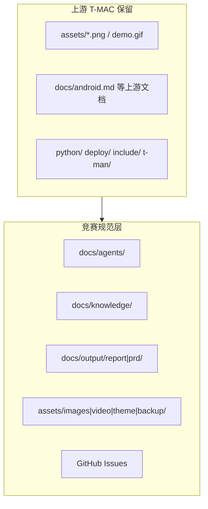

# 资产定位图

说明：本仓同时存在 **上游 T-MAC 资产** 与 **竞赛/Agent 规范资产**。搬家前先看本表。

## 总览

## 路径职责

| 路径 | 职责 | 可否挪上游文件 |
|------|------|----------------|
| `assets/*.png` `assets/demo.gif` | 上游 README 配图 | **否**（README 硬引用） |
| `assets/images/readme/` | 竞赛/本仓 README 新图 | 新图放这里 |
| `assets/images/avatar/` `icon/` | 品牌头像/图标 | 新资产 |
| `assets/video/` | 演示视频 | 新资产 |
| `assets/theme/ppt/` `script/` | 答辩 PPT、逐字稿（资产目录名，非业务 theme） | 新资产 |
| `assets/backup/` | zip/旧稿只读备份 | 迁入前登记 |
| `docs/android.md` 等 | 上游技术文档 | **否** |
| `docs/agents/` | Agent 工作流与口径 | 仅规范文档 |
| `docs/knowledge/` | 赛题/方案/仓库知识 | 从临时对话归类至此 |
| `docs/knowledge/inspiration-sources.md` | Repos + Blogs 灵感总册 | 规划优先吸收源 |
| `docs/glossary/` | 扩展术语 | — |
| `docs/adr/` | 架构决策 | — |
| `docs/output/report/` | 调研成稿（扁平，无 theme 子目录） | — |
| `docs/output/prd/` | 正式 PRD | — |
| GitHub Issues | 任务与状态跟踪 | — |
| `ohos/`（规划） | Harmony/OH 封装代码 | 实施阶段创建 |

## 停用

| 项 | 说明 |
|----|------|
| 业务 theme 子目录（如 `os-ai-accel/`） | 已取消；output 扁平 |
| `docs/output/handoff/` | handoff 流程停用 |
| `.scratch/` 本地 Issue | 改用 GitHub Issues |

## 禁止

- `docs/images/`（配图走 `assets/`）
- `docs/agents/language.md` / `docs/agents/context.md`（用根 `LANGUAGES.md` / `CONTEXT.md`）
- 把第三方标杆图原样当本项目 README 图提交
