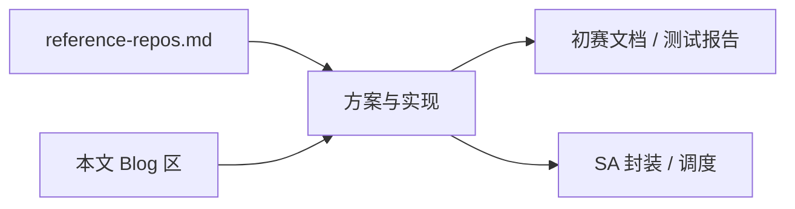

# 灵感源总册 · Repos + Blogs

Status: collected（2026-07-23）· **B1–B12 全文要点已收录**（与用户「深度筛选」清单对齐；B9/B10–B12 待补稳定 URL）  
用途：之后规划、初赛文档、架构与调度灵感**优先从本文件 + 链接仓吸收**，再落到 Issue / PRD / 报告。

> **核对：** 最高优 5 篇、高优 4 篇、中优 3 篇、阅读顺序与使用建议均已写入 §B / §C；Repos总览见 §A + [`reference-repos.md`](reference-repos.md)。

---

## A. 参考仓库（来自 Grok 对话检索）

完整表见：[`reference-repos.md`](reference-repos.md)

### A1. 主二开（锁定）

| 仓库 | URL | 灵感用途 |
|------|-----|----------|
| **microsoft/T-MAC**（本仓上游） | https://github.com/microsoft/T-MAC | LUT kernel、评测、Android/ARM 移植；作品计算核心 |
| 本 fork | https://github.com/Aafff623/fandou-t-mac | 竞赛交付与文档落盘 |

### A2. 计算演进

| # | 仓库 | URL | 灵感用途 |
|---|------|-----|----------|
| 1 | OpenBitSys/vlut.cpp | https://github.com/OpenBitSys/vlut.cpp | Vector LUT / prefill 创新点 |
| 2 | T-MAC `t-man/` | 本仓子树 | NPU / 异构调度叙事 |

### A3. OpenHarmony 系统与 AI 框架

| # | 仓库 | URL | 灵感用途 |
|---|------|-----|----------|
| 3 | openharmony/ai_engine | https://github.com/openharmony/ai_engine | AI 能力系统服务化、插件 |
| 4 | systemabilitymgr_safwk / samgr | OpenHarmony 对应仓 | SystemAbility 注册 / IPC / 生命周期 |
| 5 | ai_neural_network_runtime (NNRt) | OpenHarmony | 跨芯片推理运行时对照 |

### A4. 端侧 LLM 工程落地

| # | 仓库 | URL | 灵感用途 |
|---|------|-----|----------|
| 6 | Aloereed/llama.cpp-server-ohos | https://github.com/Aloereed/llama.cpp-server-ohos | HarmonyOS Next Server 构建部署 |
| 7 | bachjin/oh-llama.cpp | https://github.com/bachjin/oh-llama.cpp | OH + RK3588 / RKNN 工具链 |
| 8 | Turbo1123/turbo-ai-chat-harmonyos | https://github.com/Turbo1123/turbo-ai-chat-harmonyos | ArkTS + N-API + MNN 桥接 |
| 9 | OpenBMB/MiniCPM-V-Apps | HarmonyOS release | 多模态打包与模型管理 |

### A5. 基线与官方

| 资产 | 灵感用途 |
|------|----------|
| ggerganov/llama.cpp | 吞吐 / 延迟基线 |
| 华为 CANN / MindSpore Lite 文档与示例 | 量化与 NPU 对照 |

**规则：** 主代码只从 T-MAC 抽；其余仓作模式参考，禁止无授权整仓拷贝进作品。

---

## B. 参考 Blog / 文章（深度筛选收录）

来源：用户提供的「相关开发灵感文章与资源整理」；检索社区含知乎、CSDN、掘金、SegmentFault、华为开发者联盟、InfoQ、OSChina、电子工程专辑等。  
对齐目标：系统级 AI 效率、软硬件异构调度、低比特端侧 LLM、资源调度与多设备协同。

### B0. 阅读顺序（建议）

1. 精读 **B1 + B2 + B3**（T-MAC 中文解析 + CANN / openPangu）
2. 再读 **B5 + B4**（OH 全栈服务化 + 场景调度）
3. 补 **B6–B9**（调度 / 接续 / RAG 工程）
4. 最后 **B10–B12**（前景引用与扩展手段）

### B1. 最高优先级（强烈建议精读）

| # | 标题 | 来源 | URL | 理由 | 使用建议 |
|---|------|------|-----|------|----------|
| 1 | 大模型端侧 CPU 部署最高提效 6 倍！微软亚研院新开源项目 T-MAC 技术解析 | InfoQ | https://www.infoq.cn/article/RiZDLfUF9pJCixbZX1Na | 中文深拆 LUT、llama.cpp 对比、能耗吞吐、边缘实测 | 初赛创新点、技术方案、测试报告基线叙事 |
| 2 | HarmonyOS 6.1.1 全栈实战录 - 芯端侧大模型中枢：实战 CANN LM Engine 部署端侧 LLM | SegmentFault | https://segmentfault.com/a/1190000047809693 | 量化 INT8/W4A16、ONNX→OM、NPU、内存复用、KV Cache | T-MAC 与官方 AI 引擎结合 / 异构对照 |
| 3 | HarmonyOS7 端侧大模型怎么接？openPangu 2.0 接入实战与坑点 | CSDN 鸿蒙开发者社区 | https://harmonyosdev.csdn.net/6a3b6e8510ee7a33f2819de4.html | INT4、NPU、首 token / tokens/s 实测与坑点 | SystemAbility 接口与模型加载/资源管理参考 |
| 4 | 基于HarmonyOS的AI私人管家系统：全场景叠加式调度与端侧智能提速方案 | 华为开发者联盟博客 | https://developer.huawei.com/consumer/cn/blog/topic/03207740048595240 | 场景叠加调度、二进制标识、端侧记忆与压缩 | 轻量「行为→调度」逻辑，不必改内核 |
| 5 | 进迭时空成功部署「RISC-V + OpenHarmony + 本地大模型」全栈方案 | 电子工程专辑 | https://www.eet-china.com/info/73299.html | 模型服务化（OHOS AI 接口）、进程绑定/实时优先级、量化部署 | OH 上 LLM 系统服务化样板，二开 T-MAC 强相关 |

### B2. 高优先级（调度 / 异构 / 性能）

| # | 标题 | 来源 | URL | 理由 | 使用建议 |
|---|------|------|-----|------|----------|
| 6 | 鸿蒙开发心迹（10）—— 在HarmonyOS设备上实现端侧大模型应用的技术挑战与解决方案 | CSDN | https://harmonyosdev.csdn.net/6960772f0846ec2c4c5afb91.html | 内存分级、异构调度、动态精度、流水线；四层架构清晰 | 「加速服务 + 调度策略」总架构 |
| 7 | HarmonyNext内核级性能优化与多模态资源调度体系全解 | 掘金 | https://juejin.cn/post/7476030597165727754 | 异构资源调度、混合优先级、AI 预测内存预加载 | 强化「软硬件异构调度」叙事 |
| 8 | 鸿蒙PC AI原生开发：端侧算力调度与任务接续实战 | 开源鸿蒙跨平台开发者社区 | https://openharmonycrossplatform.csdn.net/6916cb7a0e4c466a32e7cde3.html | NPU/GPU/CPU 调度、模型缓存、跨设备接续示例 | 复赛多设备协同扩展 |
| 9 | 鸿蒙端侧RAG系统全链路实现-从向量检索到本地推理完整方案 | 相关技术社区（按标题检索定位） | （待补稳定 URL） | 量化+检索+推理全链路；延迟优化案例写法 | 测试报告结构与工程指标写法 |

### B3. 中优先级（视野与官方能力）

| # | 标题 | 来源 | URL | 理由 | 使用建议 |
|---|------|------|-----|------|----------|
| 10 | 华为鸿蒙7支持方舟调度引擎+性能大模型：高频应用流畅度提升22% | 搜狐 / PChome 等报道 | （按标题检索） | 方舟调度 + 性能大模型、行为预判 | 前景评估 / 社会价值引用 |
| 11 | AI 推理性能大提升：华为 UCM 技术开源，系统吞吐猛增 22 倍 | 新浪科技等 | （按标题检索） | KV Cache 多级管理与稀疏化 | 长序列 / 记忆调度讨论，可与 LUT 并列 |
| 12 | 鸿蒙开发心迹系列中关于动态稀疏化与ArkData的文章 | OSChina 等 | （按系列检索） | 动态稀疏，低比特之外的效率手段 | 扩展「效率」维度，非 P0 实现 |

### B4. 低优先级（背景）

竞赛宣传类报道（鸿蒙高校创新赛新闻等）技术深度有限，仅作赛题背景；赛题权威口径仍以 [`competition-brief.md`](competition-brief.md) 与官网为准。

---

## C. 吸收用法（强制约定）

| 场景 | 先读 | 再产出 |
|------|------|--------|
| 一句话创新点 / ≤800 字介绍 | B1、B5 + `tmac-fit.md` | 茶思屋文案 |
| 架构图 / SystemAbility 接口 | B2、B3、B5 + 仓 #3–#4 | 设计稿、ADR |
| 测试报告基线与指标 | B1、B3、仓 T-MAC / llama.cpp | `docs/output/report/` |
| 轻量调度策略 | B4、B6、B7 | 方案章节，非内核补丁 |
| 复赛多设备 / NPU | B8、B2、仓 `t-man` / CANN | Issue 拆分后再实现 |
| 代码落地 | 仓 A1 + A3–A4 | 仅模式参考，主实现仍抽 T-MAC |

**新增灵感：** 往本文件追加一行（Blog 或 Repo），并在 Issue / 报告中引用编号（如 `灵感源 B1`、`仓 #6`）。

---

## D. 待补链（URL 未稳定）

| # | 项 | 动作 |
|---|----|------|
| B9 | 端侧 RAG 全链路 | 定位稳定 URL 后回填 |
| B10–B12 | 媒体报道 / 系列文 | 选定一篇权威链后回填 |

回填时改本表即可，不必另开文件。
